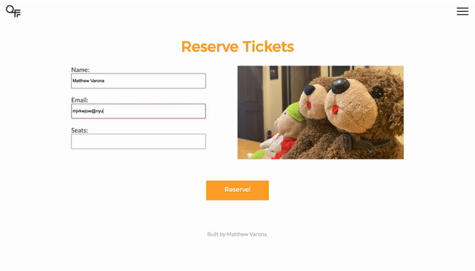

# Quarantine Film Festival (30MFF Assignment)

Based on the 30MFF exercise, I wanted to create a website for a hypothetical online film festival.

Live site demo: https://mjvar.github.io/qff/

### Design Concept
Since the site is for an online film festival – something unlikely to ever occur without the pandemic and the dominance of video conferencing – I wanted the site to have a modern feel. I chose to keep things more geometric and angular in support of this modern-ness. I also figured that since the festival is online and features films made by college students, I could afford to be a little more youthful and punchy with the copy and design, hence the mustard yellow color theme and semi-satirical text. 

### Interactivity
For the front page, I originally planned to just have a big banner image with some text. I realized I could generate more interest in the site if I had an interactive sketch of sorts at the top that was related to film. The sketch I created was simple to execute in p5.js; I experimented with drawing polygons in a grid, having them overlap, and having them react to mouse position. I ended up finding this interesting pattern from layering hexagons on top of each other.

The outlines of the shapes become more saturated the further they move from the mouse, while the fills get more saturated the closer they are to the mouse. I wanted to emulate a spotlight to fit the movie theme, while also staying true to the more angular, minimalist themes throughout the site, which is why I settled on this sketch. The spotlight starts out small, but every mouse click makes the spotlight get bigger (until it wraps back to its original size). I indicated this interactivity by setting the cursor to be a pointer while on top of the sketch.

One other piece of Javascript I used was to animate the burger menu. The script was a simple toggle between having the "open" class and not having it, which allowed me to animate the navbar. I also added some mouse-over animation for each navbar entry.

I tried to pay a lot of attention to smaller details when navigating the site, to give it some extra polish. I used some CSS to animate the burger menu icon, and I'm happy with the result:

The last bit of Javascript was to show a simple alert when the "Reserve" button is clicked on the Tickets page.

### Logo
I designed a simple logo for the festival. The Q is meant to look like a film reel, and the strange F actually shows two Fs (one in the negative space). I kept it modern and angular like the rest of my site's aesthetic.

### Process - Visuals
The final site looked very, very different from the initial wireframe. One comment I got about the wireframe was that I was cramming the screen with too much content, so I made sure to give every element breathing room in the final site. While making the actual site, I noticed that it was easier to design for a full desktop screen while developing as opposed to wireframing. I think this is because Adobe XD has a smaller canvas since menu bars and such take up a lot of the screen.

One benefit of straying from the wireframe a bit was that I could think about what actually works with my (limited) knowledge of HTML and CSS. It was easier for me to make design decisions on the go while developing rather than having to make the site look exactly like some sample on a PDF.

That being said, having a wireframe was definitely helpful for the general structure of the site. On the other hand, not religiously following the wireframe meant that I was sometimes constrained by what I knew how to do in HTML and CSS, and chose to do what was easier to implement. I don't think it necessarily turned out poorly, but I do think there would have been value in forcing myself to commit to the wireframe and implement it exactly how it looked in Adobe XD.

### Process - Implementation
I learned a lot more about the nuances of HTML and CSS. Things were quite finicky, so I had to dive deep into how the box model worked and how I could get things to act exactly how I wanted.

### Other Notes
One annoying thing I noticed was that the font I chose did not properly load across all browsers. If you test the site for yourself, you might find that the fonts don't match those in the above GIFs. I unfortunately didn't have time to find a fix for this, but it is what it is. 

Overall, though, it was fun having my first experience fully developing a webpage in HTML, CSS, and Javascript!