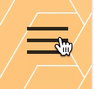

# Quarantine Film Festival (30MFF Assignment)

Based on the 30MFF exercise, I wanted to create a website for a hypothetical online film festival.

### Design Concept
Since the site is for an online film festival – something unlikely to ever occur without the pandemic and the dominance of video conferencing – I wanted the site to have a modern feel. I chose to keep things more geometric and angular in support of this modern-ness. I also figured that since the festival is online and features films made by college students, I could afford to be a little more youthful and punchy with the copy and design, hence the mustard yellow color theme. 

### Interactivity
For the front page, I originally planned to just have a big banner image with some text. I realized I could generate more interest in the site if I had an interactive sketch of sorts at the top that was related to film. The sketch I created was simple to execute in p5.js; I experimented with drawing polygons in a grid, having them overlap, and having them react to mouse position. I ended up finding this interesting pattern from layering hexagons on top of each other. The outlines of the shapes become more saturated the further they move from the mouse, while the fills get more saturated the closer they are to the mouse. I wanted to emulate a spotlight to fit the movie theme, while also staying true to the more angular, minimalist themes throughout the site, which is why I settled on this sketch. The spotlight starts out small, but every mouse click makes the spotlight get bigger (until it wraps back to its original size).

I tried to pay a lot of attention to smaller details when navigating the site, to give it some extra polish. I used some CSS to animate the burger menu:

